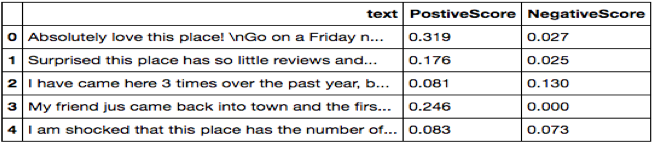
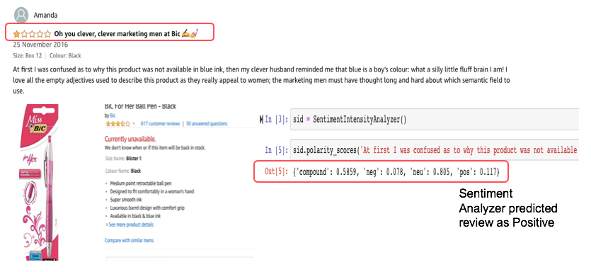
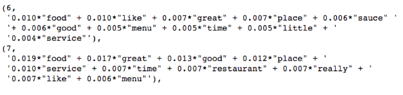
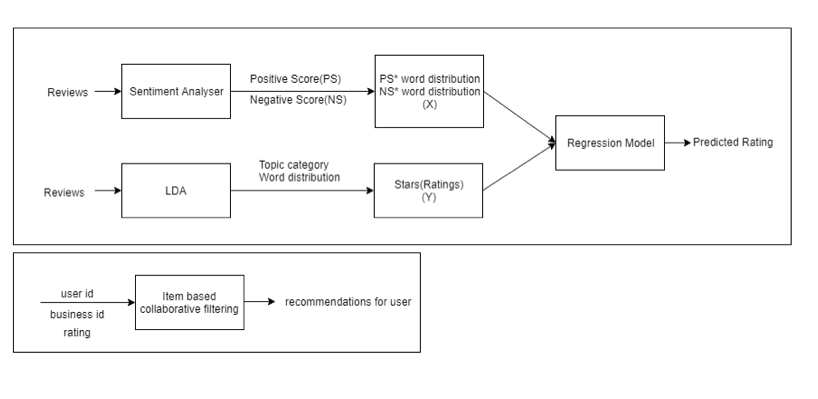
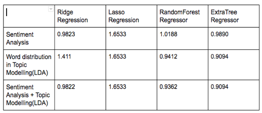

# Recommendation-System-For-Restaurants

Yelp is a platform that helps users in making a choice by providing ratings for every business. These ratings are calculated based on user’s experiences from first day till date.But, this creates a problem for the businesses. Maybe initially the business didn’t work well and got many negative ratings. But later they improved based on the response they received.Our objective in this project is to calculate ratings of restaurant based on Yelp reviews a selected quarter. To get better rating predictions we are using topic modelling algorithm called Latent Dirichlet Allocation (LDA) that extracts topics from reviews. We then calculate the polarity of the topic by doing sentiment analysis. The predicted ratings are then used to recommend the top restaurant for a quarter selected by the user.we have provided insight summary which is there ranking compared to other similar restaurants in area that will help them to understand  there standing in top performing restaurants chart. This application helps in creating a competitive environment for the restaurant owners to come in the top chart of the quarter.

#### Dataset Used
* **Link**: https://www.yelp.com/dataset/download
* **Dataset Selection**: Selected restaurants only from canada.
* **Assumptions**:
    * Considered Users who have given reviews to restaurants.
    * Considered Restaurants who has received reviews by users.
* **Breif description of files**:
    * yelp_academic_dataset_review.csv: It contains all the information about reviews like review text, business_is for whom the review is written, user_id, rating.
    * yelp_academic_dataset_business.csv: It contains all business related data like name, location, total number of reviews, avg rating.
    
#### Data Preparation/ Pre-processing
Data Pre-processing is very important step because the raw reviews are pretty messy so it cannot be used directly. We need to pre-process the reviews before doing any analysis. Below are some steps we followed to clean the data.
 * **Drop irrelevant Rows/Columns:**
   We have filtered all the data except restaurant from business file and drop all the user/business with no reviews.
 * **Filter reviews by language:**
    Only English reviews are taken into consideration and for that we have used langdetect library.
 * **Tokenization:**
    We have tokenized the reviews text into a list of words. For this we have used NTLK library.
 * **Filter Noise:**
    We have removed stop words, punctuation marks, numbers, URLs, converted all the words into lowercase.
 * **Convert Pre-processed docs to vector:**
    In order for this data to make more sense to our algorithm, we have converted reviews to vector.

#### Approach:
   * **Followed 3 approaches.**
   * Sentiment Analysis
   * Latent Dirichlet Allocation.
   * Latent Dirichlet Allocation + Sentiment Analysis.
   
##### Sentiment Analysis
   * Sentiment analysis helps predicting whether a review is positive/negative.
   * Review ratings were predicted with the positive score and negative score features only.
 

   * **This model gave us an RMSE of 0.9890**
   * **Problem with this approach**
     Sentiment Analyzer fails to capture correct sentiment of sarcastic text!
 

#### Latent Dirichlet Allocation.
   * LDA is an unsupervised topic modelling algorithm that discovers the hidden topics.
   * Since reviews justify the ratings given by the user we extract the hidden topics from the reviews and use these as features to predict the ratings.
   * With 10 extracted topics this model gave us an RMSE of 0.9402

     
#### Latent Dirichlet Allocation + Sentiment Analysis.
   * Sometimes in prediction the topic sentiment is more important that the topic distribution.
   * For example, a user may write a lot of positive words describing about the ambience of a restaurant which a sentiment analyser will wrongly predict as a 5 star review. 
   * But in reality, the user ended up with just one sentence describing about the average food which made it a 3 star rating.
   * This model captures such corner cases and gave RMSE as 0.9094  

#### Architechture

   
   
#### Results for rating prediction

   
   
#### Item Based Collaborative Filtering
   * Used Surprise library to build recommendation system.
   * **Models Tried:**
        * KNNWithMeans
        * KNNWithZScore
        * KNNBasic
        * SVD
 
#### References
   * https://cdr.lib.unc.edu/indexablecontent/uuid:398e975f-4421-4580-9890-221cc72567ea 
   * https://www.datacamp.com/community/tutorials/machine-learning-models-api-python
   * https://stackoverflow.com/questions/39142778/python-how-to-determine-the-language
   * https://www.shanelynn.ie/batch-geocoding-in-python-with-google-geocoding-api/
   * https://www.daniweb.com/programming/software-development/code/490561/postal-code-zips-and-location-python
